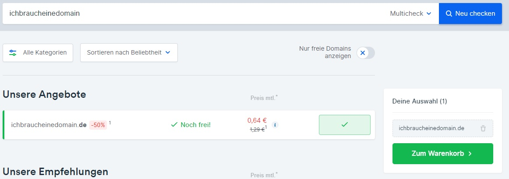
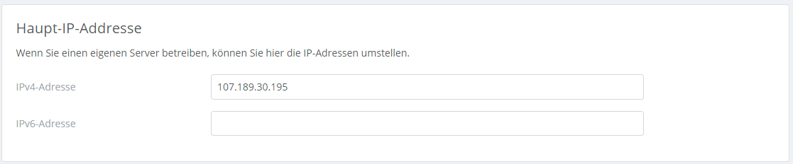
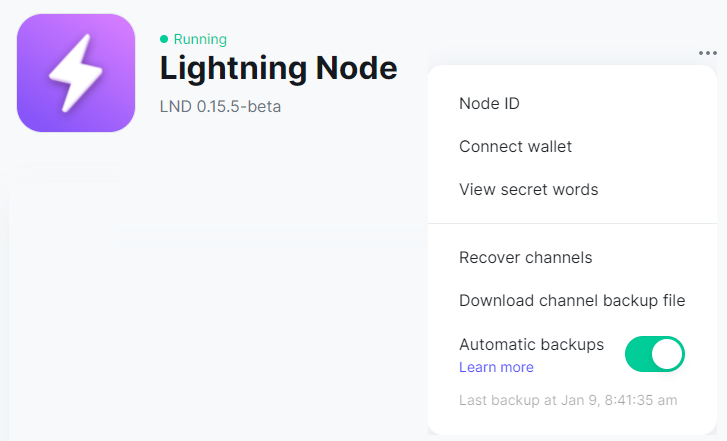
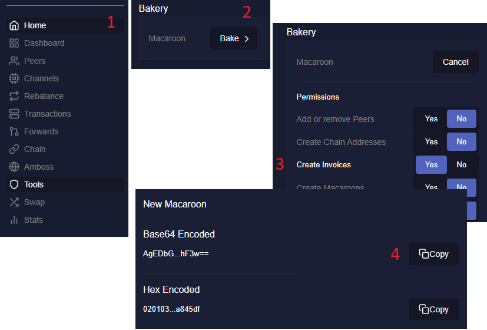
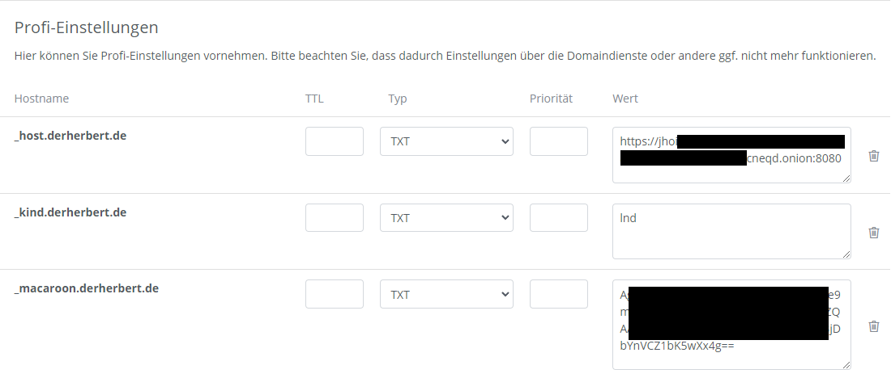

# **Eigene Lightningadresse**

Kleiner Workshop zum Einrichten einer eigenen [Lightning Adresse](https://lightningaddress.com/) mit [Wunschdomain](https://www.checkdomain.de/) und eigener Node mit LND

Getestet mit: Umbrel, Raspiblitz und Raspibolt

---
# Verwendung eines Bridge Servers

Der [Bridgeserver](https://bridgeaddr.fiatjaf.com/) ermöglicht den Empfang von Zahlungen über eine eigende Domain deinname@deinedomain.de 
Es wird eine Verbindung zur Node hergestellt und eine Invoice angefragt
Dazu muss nur eine Domain gekauft werden und ein paar DNS Einträge vorgenommen werden

---
# Domain suchen und bestellen mit checkdomain.de

---
# DNS Einträge vornehmen

---
# IP vom Bridgeserver eintragen

---
# Benötigte Daten von der Umbrel Node holen

In der Lightning Node die drei Punkte auswählen und auf "Connect wallet"

---
# lndconnect URL in eine Textdatei kopieren

lndconnect URL in eine Textdatei kopieren und den vorderen Teil "lndconnect://" mit "https://" ersetzen
Nicht die Macaroon verwenden

---
# Was ist ein Macaroon?

- Ein Macaroon ist ein Sicherheitstoken um die Zugriffsrechte auf bestimmte Aktionen und Ressourcen zu kontrollieren
- Gibt eine Zugriffsbescheinigung für spezifische Aktionen wie z.B. eine Invoice erstellen oder auch Zahlungen zu senden
- Das Macaroon in der Folie davor ist z.B. für Zeus und gibt volle Zugriffsrechte --> das wollen wir nicht

---
# Invoice Macaroon mit Thunderhub erstellen

Macaroon auch in die Textdatei kopieren

---
# Hostnamen vergeben
Zurück zu checkdomain.de und noch folgende DNS Einträge vornehmen

Auf Speichern drücken und mit [lnurlpay](https://www.lnurlpay.com/) oder WoS testen ob die LN Adresse funktioniert

---
# Das gleiche mit dem Raspiblitz

---
# Das gleiche mit dem Raspiblitz

---

# Für Raspibolt:

in torrc einen bereich für eine lnd Rest schnittstelle
sudo nano /etc/tor/torrc

############### This section is just for location-hidden services ###
HiddenServiceDir /var/lib/tor/hidden_service_lnd_rest/
HiddenServiceVersion 3
HiddenServicePort 8080 127.0.0.1:8080

tor neu laden und connection addresse anzeigen lassen
 $ sudo systemctl reload tor
 $ sudo cat /var/lib/tor/hidden_service_lnd_rest/hostname

---

 lnd connect installieren
$ cd /tmp
$ wget https://github.com/LN-Zap/lndconnect/releases/download/v0.2.0/lndconnect-linux-arm64-v0.2.0.tar.gz
$ tar -xvf lndconnect-linux-arm64-v0.2.0.tar.gz
$ sudo install -m 0755 -o root -g root -t /usr/local/bin lndconnect-linux-arm64-v0.2.0/lndconnect

mit folgendem befehl den lndconnect anzeigen lassen

lndconnect --host=abcdefg........Hier die Addresse von oben......xyz.onion --port=8080

Onion Adresse + Port in checkdomain kopieren

für invoice macaroon:

lncli bakemacaroon invoices:write

String in checkdomain kopieren